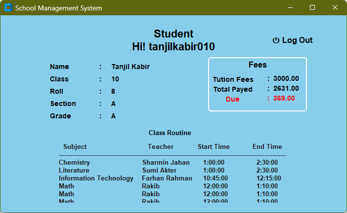

# 🎓 School Management System

Welcome to our first full-fledged **Database Application Project** designed to simplify school operations for administrators, teachers, and students.

---

## 🧾 Description

The **School Management System** is a desktop software solution to efficiently handle routine school management tasks. It features role-based access and custom dashboards for each user type:

- 🏫 **Admin**: Manage students, teachers, and school settings  
- 👨‍🏫 **Teacher**: View class routines and daily schedules  
- 👨‍🎓 **Student**: Access personal details, class schedules, fee status, and grades

---

## ✨ Features

### 🛠️ Admin Capabilities
- ➕ Add, 🔍 search, and ❌ delete students and teachers
- 👁️ View all student and teacher records
- 💸 Update student tuition fees
- 🔐 Reset forgotten passwords (for registered users)
- 📝 New user registration

### 📚 Teacher Dashboard
- 📅 View daily class routine with exact timings
- 📊 See total number of classes for the current day

### 📖 Student Dashboard
- 🆔 View personal details
- 🗓️ Check class routine and time
- 💰 View tuition and paid fees
- 🧾 Access exam grades

---

## 🧰 Tech Stack

| Layer        | Technology         |
|--------------|--------------------|
| 🖥️ Frontend   | Python + [CustomTkinter](https://github.com/TomSchimansky/CustomTkinter) |
| 🗄️ Backend    | MySQL Database     |
| 🖱️ Platform   | Windows `.exe`     |

---

## ⚙️ Setup

🟢 **No installation required!**  
Just run the provided `.exe` file on any Windows desktop to launch the software.

---

## 🚀 How to Use

1. 🔐 Launch the application and login using your credentials
2. 📂 Get redirected to your role-specific dashboard (Admin, Teacher, or Student)
3. 🎯 Perform your operations and manage school data efficiently

---

## 🖼️ Screenshots

```markdown



```

---

## 👥 Meet the Team (ChronoMate)

| Name                         | Role             | GitHub Profile |
|------------------------------|------------------|----------------|
| **MD JOBAER ISLAM ALIF**     | Main Developer   | [GitHub](https://github.com/alifjobaer12) |
| **MD. ISMAIL HOSSAIN SHEZAN**| Developer        | [GitHub](https://github.com/kenshiro147) |
| **MD RAKIB ALI**             | Developer        | [GitHub](https://github.com/Rakibislam22) |
| **PRANTA KUMER PANDIT**      | Developer        | [GitHub](https://github.com/your-github-username-here) |
| **JUBAER RAHMAN**            | Developer        | [GitHub](https://github.com/jubaerjisan) |


---

## 🔮 Future Enhancements

- 📌 Attendance tracking system
- 📬 Notification system for teachers and students
- 📤 Export reports to PDF
- 📱 SMS or email alerts for parents

---

## 📄 License

> This project is developed for educational purposes only.

---

🚀 *Thank you for exploring our project!*  
Made with ❤️ by our team.

